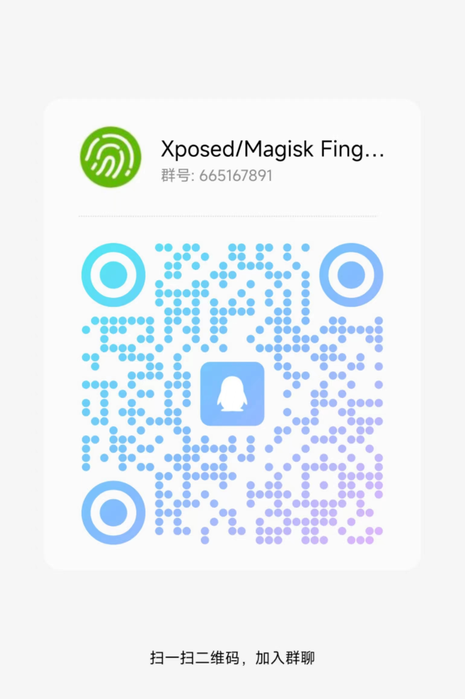

# FingerprintPay
让微信、支付宝、淘宝、腾讯QQ、云闪付在支持指纹识别的手机上使用指纹支付.

## 请注意: 支付宝支持刷脸支付, 体验感官跟苹果的Face ID差不多, 请考虑优先使用

## 最低要求
* 有指纹硬件
* Android 6.0+
* Android 5.1+(部分魅族机型)
* Android 4.4+(部分三星机型)
* [Magisk](https://github.com/topjohnwu/Magisk)、[Zygisk](https://github.com/topjohnwu/Magisk) 、 [Xposed](https://github.com/ElderDrivers/EdXposed) 或 [KernelSU](https://github.com/tiann/KernelSU) + [Zygisk Next](https://github.com/Dr-TSNG/ZygiskNext)

## 他怎么工作呢？
1. 利用 [Magisk](https://github.com/topjohnwu/Magisk) 的 [Riru](https://github.com/RikkaApps/Riru)模块 或 Zygisk 加载指纹支付模块
2. 在指纹支付模块中录入应用的支付密码
3. 将密码加密保存至本地
4. 对应程序在支付界面时, 验证手机指纹, 验证成功解密密码
5. 自动替代用户输入支付密码, 完成支付操作

## 国内镜像
- [点这里](https://file.xdow.net/fingerprintpay/)

## 使用步骤 Magisk + Zygisk
1. 确认 Magisk Manager 应用设置中启用 Zygisk功能
2. 下载插件: [zygisk-module-xfingerprint-pay-all-release.zip](https://github.com/eritpchy/FingerprintPay/releases)
3. 进入 Magisk Manager, 模块, 安装这几个模块, 不要重启
4. 确认启用模块, 重启手机
5. Enjoy

## 使用步骤 KernelSU + Zygisk Next
1. 下载插件: [Zygisk-Next-release.zip](https://github.com/Dr-TSNG/ZygiskNext/releases)
2. 下载插件: [zygisk-module-xfingerprint-pay-all-release.zip](https://github.com/eritpchy/FingerprintPay/releases)
3. 进入 KernelSU 管理器, 模块, 安装这几个模块, 没装完不要重启, 安装完毕后再重启手机
4. 开机后确认模块工作是否正常, 若不正常再次重启手机
5. Enjoy

## 使用步骤 Magisk + Riru

 

点击展开(过时, Riru已停止维护)

1. 下载插件: [riru-release.zip](https://github.com/RikkaApps/Riru/releases)
2. 下载插件: [riru-module-xfingerprint-pay-all-release.zip](https://github.com/eritpchy/FingerprintPay/releases)
3. 进入 Magisk Manager, 模块, 安装这几个模块, 不要重启
4. 确认启用模块, 重启手机
5. Enjoy

## 使用步骤 Xposed 
> (2023.11.08, 不推荐, Xposed框架会导致大概率触发面部识别验证)
1. 下载并安装插件: [xposed.com.surcumference.fingerprintpay.release.apk](https://github.com/eritpchy/FingerprintPay/releases/latest)
2. 在Xposed管理器启用插件
3. 重启手机
4. Enjoy

## 详细教程
1. [支付宝](https://github.com/eritpchy/FingerprintPay/tree/main/doc/Alipay)
2. [淘宝](https://github.com/eritpchy/FingerprintPay/tree/main/doc/Taobao)
3. [微信](https://github.com/eritpchy/FingerprintPay/tree/main/doc/WeChat)
4. [QQ](https://github.com/eritpchy/FingerprintPay/tree/main/doc/QQ)
5. [云闪付](https://github.com/eritpchy/FingerprintPay/tree/main/doc/UnionPay)

## 常见问题
1. 因Xposed 造成的开机卡住, 可按电源键禁用Xposed (多次振动后重启手机)
2. 可以解锁手机但提示系统指纹未启用\
   2.1 QQ请确认版本在7.2.5以上\
   2.2 说明您的手机系统版本过低不支持, 请升级至安卓6.0以上
3. 插件已安装, 但在微信或支付宝中看不见菜单?\
   3.1 请逐个检查支付宝、淘宝、微信的菜单项， 是否有任何一个已激活\
   3.2 请同时安装其它插件, 比如微x 确保Xposed是正常的工作的\
   3.3 尝试, 取消勾选插件, 再次勾选插件, 关机, 再开机
4. Xposed版只能使用play版本云闪付, 否则打开闪退! riru, zygisk版本暂未发现相关问题

## 致谢
* [Riru](https://github.com/RikkaApps/Riru)
* [EdXposed](https://github.com/ElderDrivers/EdXposed)
* [Magisk](https://github.com/topjohnwu/Magisk)
* [WechatFp](https://github.com/dss16694/WechatFp)
* [Zygisk Next](https://github.com/Dr-TSNG/ZygiskNext)
* [KernelSU](https://github.com/tiann/KernelSU)
* [Magisk Delta](https://huskydg.github.io/magisk-files/)
* [LSPosed](https://github.com/LSPosed/LSPosed)

## 提示
1. 本软件的网络功能仅限检查自己软件更新功能, 如不放心, 欢迎REVIEW代码.
2. 支付宝、淘宝、微信、QQ、云闪付均可沿用市场中的最新版.
3. 云闪付请用play版本
4. 支付宝10.3.80.9100及以上版本请前往 设置-->支付设置 中查找入口
5. 自4.7.4版本开始, 为减少打扰, 非紧急更新推送暂缓推送
6. Magisk Delta + Zygisk Next 组合 截止2023年11月8日目前这两软件尚未互相适配, 切勿尝试!
7. Magisk 本身自带Zygisk功能, 切勿尝试 Magisk + Zygisk Next 这么无聊的组合

#### QQ交流群: [665167891](https://h5.qun.qq.com/h5/qun-share-page/?_wv=1027&k=fCZf_WEKL1Rj_N0gi9JgkH7bfnKj11Wy&authKey=acNcoIs325Uco7v2JZY4NObRFA3sJU%2FWI1%2FH64DkP50cn6HBRUzBZ9cvZGNqmzGi&market_channel_source=665167891_1&noverify=0&group_code=665167891)
